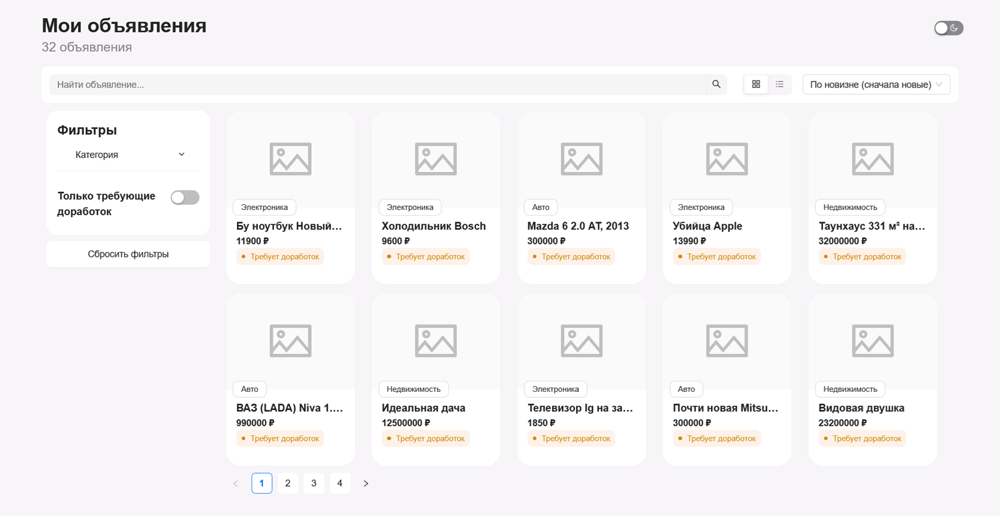
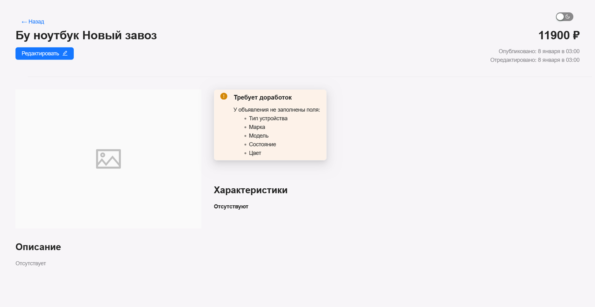
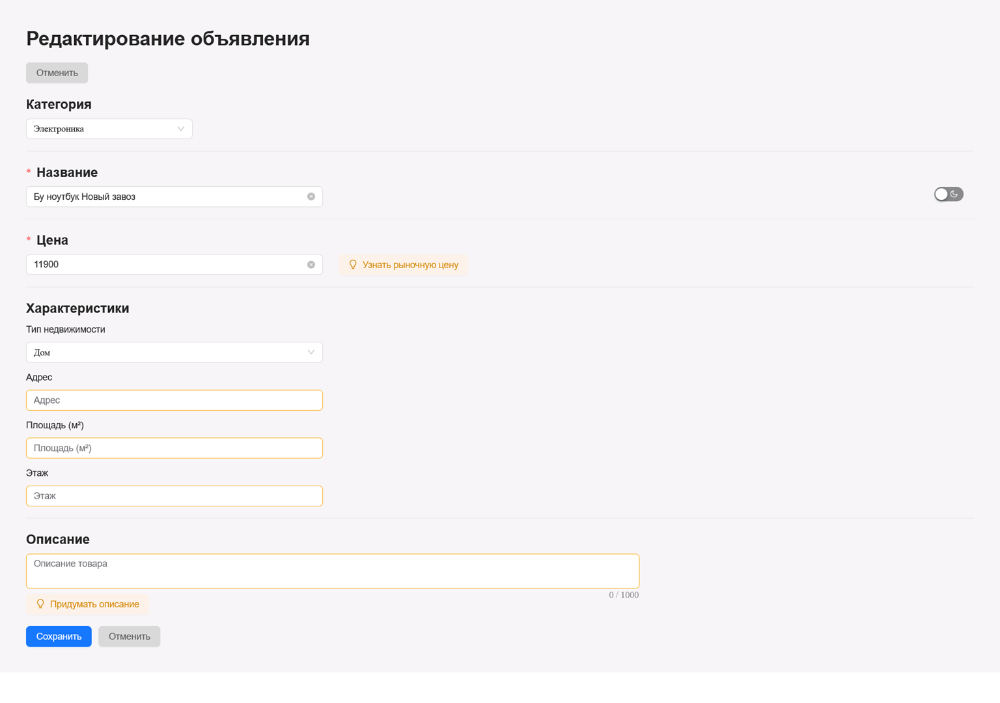
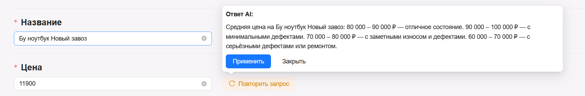

# AI-ассистент для карточек товара

## Задача

Разработать веб-приложение — личный кабинет продавца с интегрированным AI-ассистентом, который помогает улучшать описания объявлений. Продавец видит список своих объявлений, выбирает нужное и может просмотреть карточку товара, перейти к редактированию и запросить рекомендации от нейросети. Сервис анализирует содержимое карточки товара и предлагает улучшения текста.

## Использованные технологии

- React
- TypeScript
- UI-библиотека: Ant Design
- Стейт-менеджер: Redux
- Форматтер Prettier и линтер ESLint
- Система сборки: Vite
- Для HTTP-запросов: TanStack Query, Axios
- LLM модель: llama3

> ⚠️ Проект использует локальную LLM для демонстрации

## Что было реализовано?

> Отображение состояния загрузки данных и отображение ошибок на каждой странице.

Приложение состоит из 4 страниц (3 уникальных):

### Страница списка объявлений



Отображение всех объявлений продавца.

- Поиск объявлений по названию
- Фильтры (боковая панель)
- Сортировки
- Пагинация по 10 объявлений на страницу

### Страница просмотра объявления



Отображение полной информации об объявлении в режиме просмотра

- Если у объявления не заполнены некоторые поля, отображается предупреждение с перечнем незаполненных полей

### Страница редактирования объявления



Форма редактирования существующего объявления с основными полями формы (зависят от выбранной категории)

- AI-функции:
   Кнопка «Придумать описание» / «Улучшить описание» — предлагает сгенерированное описание, которое можно автоматически подставить в поле по кнопке «Применить»
   Кнопка «Узнать рыночную цену» — предлагает актуальную цену на товар



Помимо основного функционала были реализованы:

- Визуальное сравнение «Было → Стало» в описании через подсветку добавленного/удаленного текста в предложенном LLM варианте
- Тёмная тема с сохранением выбора в localStorage
- Прерывание запросов при переходе между страницами через AbortController
- Выбор лейаута сетка/список на странице списка объявлений

## Установка и запуск

> Установку Ollama можно пропустить, но тогда не удастся воспользоваться всеми функциями

1. Установите [Ollama](https://ollama.com/)
2. Загрузите модель:

   ```bash
   ollama pull llama3
   ```

3. Убедитесь, что Ollama запущена:

   ```bash
   ollama serve
   ```

4. Находясь в папке с проектом выполните:

   ```bash
   npm run start-app
   ```

После этого приложение будет доступно по адресу: <http://localhost:4173>
